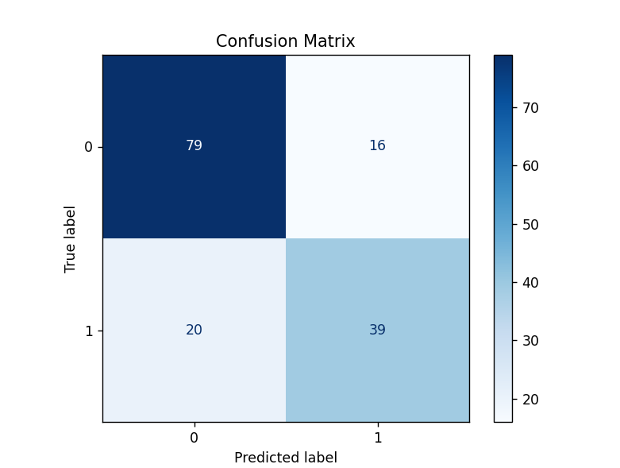
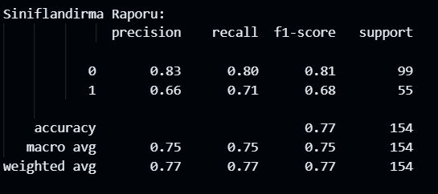

# YZM212_Lab1
Makine Öğrenmesi ödevleri için oluşturulmuş GitHub deposu.
Veri setim: https://www.kaggle.com/datasets/uciml/pima-indians-diabetes-database

İkili sınıflandırma için diyabet ve diyabeti etkiliyebilecek olan durumların bulunduğu bir veri seti seçtim. Veri setimde 769 satır, 9 adet sütun içermektedir. Veri setim sürekli veriler içeriyordu bundan dolayı Gaussian naive bayes modelini kullandım. Bunların sonucunda aşağıdaki karmaşıklık matrisini elde ettim.

Bu karmaşıklık matrisinden yola çıkarak manuel olarak accuracy metriğini hesapladığımda ≃ 0.77 sonucuna ulaştım. Accuracy metriğini kod kullanarak hesapladığımda da yine ≃ 0.77 sonucunu elde ettim. Diğer metrikleri scikit learnden sınıflandırma raporu methoduyla buldum.
 

Scikit Learn kütüphanesini kullandığım modelin çalışma süresi 0.0015 iken, kullanmadığım modelin çalışma süresi şu şekildedir: 0.0072. Veri setimin küçük olmasından kaynaklı bu fark çok fazla görünmese de büyük veri setlerinde bu çalışma hızı farkı önemli olabilir. Çalışma süresinden yola çıkarak Scikit Learn kullandığım modelin daha hızlı çalıştığı ve dolayısıyla daha optimal olduğunu söyleyebilirim.

Karmaşıklık matrisine geldiğimde iki modelde de aynı sonucu aldım. Burdan yola çıkarak yaptığım implementasyonun doğru olduğu sonucuna vardım.

Değerlendirme metrikleri seçiminde problem ve sınıf dağılımı önemli midir?
Evet, önemlidir. Dengesiz veri setlerinde accuracy yanıltıcı olabilir dengesiz veri olma olasılığına karşın precision, recall, f1 skoru önemli metrikler haline gelir.  Bu metrikler sınıflar arasındaki dengesizliği göz önünde bulundurur.

Kullandığım veri seti sağlık verileri üzerine olduğu için false negative hatası ciddi sonuçlar doğurabilir. Bu durumda recall metriği önem kazanır. Recall sonucuna göre bu model gerçek hastaların %71'i doğru tespit edebilmiş. 
